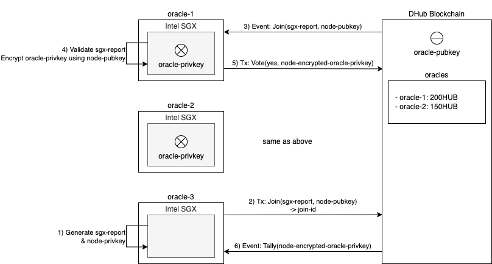
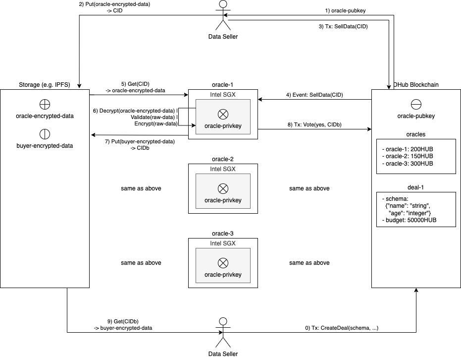

# PoC: Decentralized Oracle for sensitive data validation

This is a proof-of-concept of the decentralized oracle which validates off-chain data while preserving privacy powered by on-chain proof-of-stake and Intel SGX.


## Problem Statements

### Needs of data validation

- To make the data sales process secure and atomic, data being sold must be validated.
	- For example, it should be validated that data is in the format desired by the buyer.
- It is not a good idea to let blockchains validate data, because blockchains are not suitable for handling large data. Also, it is not recommended to put sensitive data to the blockchain even if it is encrypted due to potential security risks.
- For these reasons, it is necessary to have an off-chain data validator.

### Challenges & Solutions

- There can be a number of Byzantine data validators.
	- Solution: Proof-of-stake powered by the blockchain
- The operator (human) of data validators can see the contents of sensitive data.
	- Solution: Secure enclave powered by Intel SGX


## Hardware Requirements

The oracle only works on [SGX](https://www.intel.com/content/www/us/en/developer/tools/software-guard-extensions/overview.html)-[FLC](https://github.com/intel/linux-sgx/blob/master/psw/ae/ref_le/ref_le.md) environment with a [quote provider](https://docs.edgeless.systems/ego/#/reference/attest) installed.
You can check if your hardware supports SGX and it is enabled in the BIOS by following [EGo guide](https://docs.edgeless.systems/ego/#/getting-started/troubleshoot?id=hardware).


## Prerequisites

```bash
sudo apt update
sudo apt install build-essential libssl-dev

sudo snap install go --classic
sudo snap install ego-dev --classic
sudo ego install az-dcap-client

sudo usermod -a -G sgx_prv $USER
# If not
#
# [error_driver2api sgx_enclave_common.cpp:273] Enclave not authorized to run, .e.g. provisioning enclave hosted in app without access rights to /dev/sgx_provision. You need add the user id to group sgx_prv or run the app as root.
# [load_pce ../pce_wrapper.cpp:175] Error, call sgx_create_enclave for PCE fail [load_pce], SGXError:4004.
# ERROR: quote3_error_t=SGX_QL_INTERFACE_UNAVAILABLE (oe_result_t=OE_PLATFORM_ERROR) [openenclave-src/host/sgx/sgxquote.c:oe_sgx_qe_get_target_info:706]
# ERROR: SGX Plugin _get_report(): failed to get ecdsa report. OE_PLATFORM_ERROR (oe_result_t=OE_PLATFORM_ERROR) [openenclave-src/enclave/sgx/attester.c:_get_report:320]
```


## Build and sign

First of all, please prepare a signing key and a `enclave.json`.
```bash
openssl genrsa -out private.pem -3 3072
openssl rsa -in private.pem -pubout -out public.pem
```
```json
{
	"exe": "doracle-poc",
	"key": "private.pem",
	"debug": true,
	"heapSize": 512,
	"executableHeap": false,
	"productID": 1,
	"securityVersion": 1,
	"mounts": [
		{
			"source": "<a-directory-you-want>",
			"target": "/data",
			"type": "hostfs",
			"readOnly": false
		},
		{
			"target": "/tmp",
			"type": "memfs"
		}
	],
	"env": null,
	"files": null
}
```

Then, build a binary and sign it using the key that you generated.
```bash
ego-go build -o doracle-poc cmd/doracle-poc/main.go
ego sign doracle-poc
```


## Run

Before running the binary, the environment variable `SGX_AESM_ADDR` must be unset.
If not, the Azure DCAP client won't be used automatically.
```bash
unset SGX_AESM_ADDR
# If not,
#
# ERROR: sgxquoteexprovider: failed to load libsgx_quote_ex.so.1: libsgx_quote_ex.so.1: cannot open shared object file: No such file or directory [openenclave-src/host/sgx/linux/sgxquoteexloader.c:oe_sgx_load_quote_ex_library:118]
# ERROR: Failed to load SGX quote-ex library (oe_result_t=OE_QUOTE_LIBRARY_LOAD_ERROR) [openenclave-src/host/sgx/sgxquote.c:oe_sgx_qe_get_target_info:688]
# ERROR: SGX Plugin _get_report(): failed to get ecdsa report. OE_QUOTE_LIBRARY_LOAD_ERROR (oe_result_t=OE_QUOTE_LIBRARY_LOAD_ERROR) [openenclave-src/enclave/sgx/attester.c:_get_report:320]
```

Run the binary using `ego` so that it can be run in the secure enclave.
```bash
export AZDCAP_DEBUG_LOG_LEVEL=INFO

# For the first oracle that should generate an oracle key,
ego run doracle-poc \
	-tm-rpc tcp://<tendermint-rpc-ip>:<port> \
	-chain-id dhub-1 \
	-operator "fossil mimic ... river" \
	-init

# For an oracle that joins to the existing oracle group,
ego run doracle-poc \
	-tm-rpc tcp://<tendermint-rpc-ip>:<port> \
	-chain-id dhub-1 \
	-operator "fossil mimic ... river" \
	-join

# For restarting the oracle that already has the oracle key,
ego run doracle-poc \
	-tm-rpc tcp://<tendermint-rpc-ip>:<port> \
	-chain-id dhub-1 \
	-operator "fossil mimic ... river"
```


## Architecture

### Oracle Joining Process



First of all, we should assume that the 1st oracle exists and is innocent (the genuine binary is running in the SGX).

By validating the SGX report of the new node, we can ensure that the new node is running the genuine binary in the SGX.
The signer ID, product ID, security version, and report data must be validated.


### Data Validation Process



A key point is that data sellers must encrypt their data using the oracle public key
which was generated in the SGX, so that oracle node operators cannot see the decrypted data contents.

A pitfall here is that there is yet no fancy way to deliver the data to the data buyer.
If we let the data seller to send the data to the buyer directly after oracles complete the data validation, there is a risk that the data seller can send a fake data that is
not equal to the data submitted to oracles.
Thus, we need to rely on oracles to upload re-encrypted data using the buyer's public key
to the storage, so that the buyer can download it.
Of course, the re-encryption must be done in the SGX.
A downside is that all oracles upload the same data to the storage. This downside can be mitigated if we use a storage like IPFS which doesn't store duplicated data pieces.


## TODOs

- Proof of stake
- Data validation